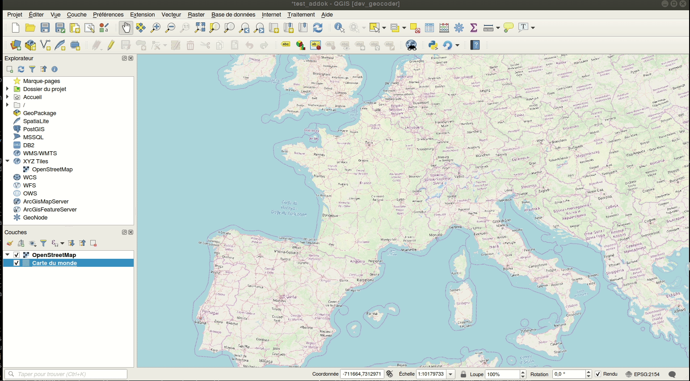

Extension de recherche de lieux utilisant l'API adresse ADDOK geo.api.gouv.fr/adresse 
====================================

Cette extension permet d'activer la recherche de lieu par adresse dans la barre de recherche universelle de QGIS (Localisateur). 
Elle se base sur l'API publique fournie par https://geo.api.gouv.fr/adresse

Ce plugin est basé sur le code de l'extension Nominatim filter. Pour en savoir plus:

http://www.qgis.nl/2018/05/16/english-coding-a-qgslocator-plugin/

http://plugins.qgis.org/plugins/french_adress_locator

Utilisation:

- taper librement une recherche d'adresse dans la barre de recherche (en bas à gauche de la fenêtre QGIS)
- Sélectionner un résultat. Double clic ou entrée déplace la carte sur l'adresse retenue
- taper le préfix `fr` permet de ne rechercher que des adresses fournies par ce service (et évite de rechercher les autres objets indexés par la barre Localisateur)

Notes:
 - l'API ne renvoie pas d'emprise permettant de zoomer exactement. Les zooms prédéfinis sont 1/25 000 , 1/5000 et 1/2000 en fonction du type de résultat (ville, rue, adresse précise)

QGIS ADDOK French address Locator Filter Plugin
====================================

This is a so called QgsLocator filter for the French Adress API search service, 
implemented as a QGIS plugin.

This plugin is forked from Nominatim filter plugin. Read about writing one here:

http://www.qgis.nl/2018/05/16/english-coding-a-qgslocator-plugin/

This Locator Filter searches for names in the https://geo.api.gouv.fr/adresse service

You can install this 'Locator Filter' as a plugin by searching for it in 
the QGIS plugin manager in your QGIS desktop, search for 'geocoder':

http://plugins.qgis.org/plugins/french_adress_locator

Some more docs and api's:

http://api.qgis.org/api/master/html/classQgisInterface.html

http://python.qgis.org/api/core/Locator/QgsLocator.html

http://python.qgis.org/api/core/Locator/QgsLocatorFilter.html

